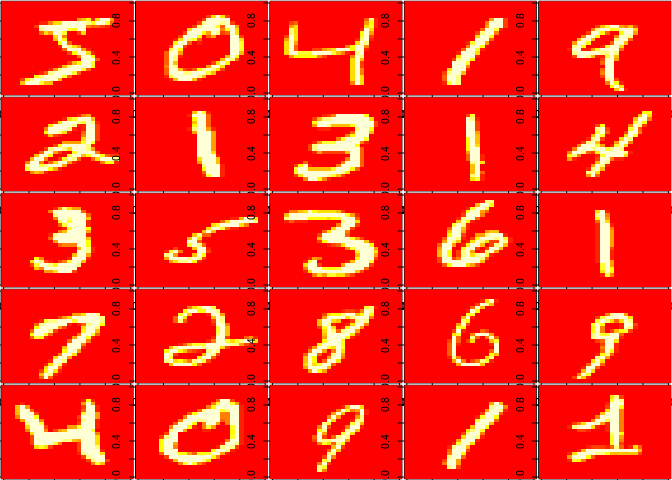
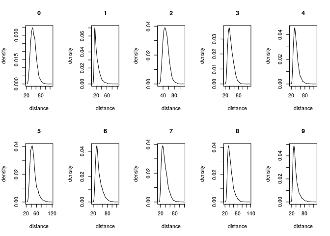
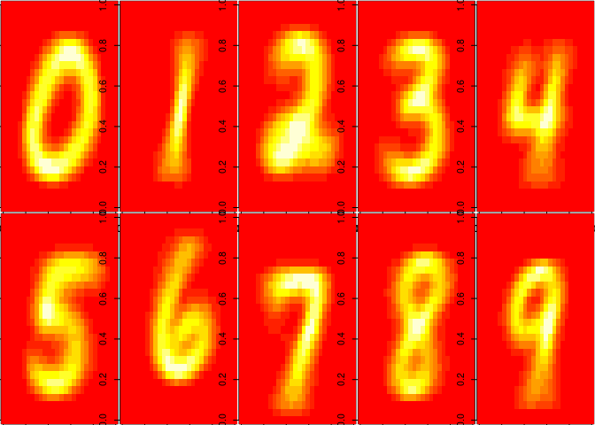

Exploratory Data Analysis
================
Yilin Li, Hien Nguyen, Lyn Peterson
2019/11/18

### Data description

Our data is the MNIST database of handwritten digits, collected from this page <http://yann.lecun.com/exdb/mnist/>. The digits have been size-normalized and centered in a fixed-size image.

The training set contains 60,000 examples, and the test set 10,000 examples.

Our observations are images. Each image is composed of 28\*28 = 748 pixels, where each pixel value ranges from 0-255. We use all 748 pixels as our predictors. *n* = 70,000; *p* = 748.

### Data exploration

``` r
# This part read idx files and store image data into train$x and 
# test$x in matrix form, store corresponding labels in train$y 
# and test$y in array form 
load_image_file <- function(filename) {
   ret = list()
    f = file(filename,'rb')
    readBin(f,'integer',n=1,size=4,endian='big')
    ret$n = readBin(f,'integer',n=1,size=4,endian='big')
    nrow = readBin(f,'integer',n=1,size=4,endian='big')
    ncol = readBin(f,'integer',n=1,size=4,endian='big')
    x = readBin(f,'integer',n=ret$n*nrow*ncol,size=1,signed=F)
    ret$x = matrix(x, ncol=nrow*ncol, byrow=T)
    close(f)
    ret
}

load_label_file <- function(filename) {
    f = file(filename,'rb')
    readBin(f,'integer',n=1,size=4,endian='big')
    n = readBin(f,'integer',n=1,size=4,endian='big')
    y = readBin(f,'integer',n=n,size=1,signed=F)
    close(f)
    y
}

train <- load_image_file("data/train-images-idx3-ubyte")
test <- load_image_file("data/t10k-images-idx3-ubyte")

train$y <- load_label_file("data/train-labels-idx1-ubyte")
test$y <- load_label_file("data/t10k-labels-idx1-ubyte")  
```

We can take a look at the first 25 images.

``` r
par(mfrow=c(5,5))
par(mar=c(0.1,0.1,0.1,0.1))
for (i in 1:25){
  image(matrix(train$x[i,],28)[,28:1])
}
```



``` r
library(ggplot2)

# normalize pixel values from 0-255 to 0-1 
train$st <- train$x/255
test$st <- test$x/255

# for each digit class, calculate the mean digit, mean distance from the mean digit and 
# variance of the distance

label <- seq(0,9) 

distance_mean <- rep(NA,10)
distance_var <- rep(NA,10)
mean_digits <- matrix(rep(0,7840),10)

par(mfrow=c(2,5))

for(i in 1:10){
  df <- train$st[train$y ==label[i],]   # create a dataframe with only the i-th digit
  mean_digit <- colMeans(df)            # get the mean form for each digit(0-9)
  mean_digits[i,] <- mean_digit         # store the mean image into mean_digits 
  dif <- sweep(df,2,mean_digit)         # store the difference for each image from its mean form 
  distance <- rowSums(dif^2)            # distance is an arrary of Euclidean distances from each image to its mean form
  distance_mean[i] <- mean(distance)
  distance_var[i] <- var(distance)
  
  # plot density of distances for each digit 
  plot(density(distance), xlab = "distance", ylab = "density", main = as.character(label[i]))
}
```



``` r
dist_df <- data.frame(x = distance_mean, y = distance_var)
colnames(dist_df) <- c("distance mean", "distance var")
rownames(dist_df) <- label
print(dist_df)
```

    ##   distance mean distance var
    ## 0      49.91889     140.5000
    ## 1      22.47562     107.3414
    ## 2      50.76020     107.3001
    ## 3      44.94435     150.5974
    ## 4      40.87232     130.9288
    ## 5      47.58101     142.0700
    ## 6      43.09167     179.6460
    ## 7      37.47072     157.1436
    ## 8      45.59575     165.0296
    ## 9      38.56896     179.6759

From the summary table, we can see that digit "1" has the lowest mean distance; this indicates that most people write it similarly. "2" has the highest mean distance, so people tend to write "2" in different ways. We also see that "6" and "9" have the highest distance variance, which suggests these two digits have the most variation in people's writing styles.

We can take a look at the mean image for each digit.

``` r
# Display the mean form for each digit
par(mfrow=c(2,5))
par(mar=c(0.1,0.1,0.1,0.1))
for (i in 1:10){
  image(matrix(mean_digits[i,],28)[,28:1]*255)
}
```


