```{r setup, include=FALSE}
library(dplyr)
library(tidyr)
library(ggplot2)
library(MASS)
library(tree)
library(gbm)
library(randomForest)
library(class)
library(e1071)  
library(tidyverse)
library(caret)
library(nnet)
library(glmnet)
library(doParallel)
library(rpart)
library(imager)
```


Your technical report should be an .Rmd file that contains the following sections. So as not to make the compilation (knitting) of the document not take too long, consider setting cache = TRUE in the curly braces of any R chunk with substantial computing. Please knit both to pdf and github document (.md).

## Abstract
**A brief overview of the area that you’ll be investigating, the research question(s) of interest, your approach to analysis, and the general conclusions.**

Overview:

Research question: Can we build classifiers to recognize what the digit (0-9) is in a given image based on 60,000 training images?

Approach to analysis:

General conclusions:

## Introduction
**Overview of the setting of the data, existing theories/models (particularly if you are working in a descriptive/inferential setting), and your research questions.**

## The Data
**Where does the data come from? How many observations? How many variables? What does each observation refer to (what is the observational unit)? What sorts of data processing was necessary to get the data in shape for analysis?**

```{r loading-data, cache=TRUE, include=FALSE}
# This part read idx files and store image data into train$x and 
# test$x in matrix form, store corresponding labels in train$y 
# and test$y in array form 
load_image_file <- function(filename) {
   ret = list()
    f = file(filename,'rb')
    readBin(f,'integer',n=1,size=4,endian='big')
    ret$n = readBin(f,'integer',n=1,size=4,endian='big')
    nrow = readBin(f,'integer',n=1,size=4,endian='big')
    ncol = readBin(f,'integer',n=1,size=4,endian='big')
    x = readBin(f,'integer',n=ret$n*nrow*ncol,size=1,signed=F)
    ret$x = matrix(x, ncol=nrow*ncol, byrow=T)
    close(f)
    ret
}

load_label_file <- function(filename) {
    f = file(filename,'rb')
    readBin(f,'integer',n=1,size=4,endian='big')
    n = readBin(f,'integer',n=1,size=4,endian='big')
    y = readBin(f,'integer',n=n,size=1,signed=F)
    close(f)
    y
}

train <- load_image_file("data/train-images-idx3-ubyte")
test <- load_image_file("data/t10k-images-idx3-ubyte")
# rescale pixels for computational reason
train$x <- train$x/255
test$x <- test$x/255

train$y <- load_label_file("data/train-labels-idx1-ubyte")
test$y <- load_label_file("data/t10k-labels-idx1-ubyte")  

train_df <- data.frame(train$y, train$x) %>%
  rename(label = train.y)
test_df <- data.frame(test$y, test$x) %>%
  rename(label = test.y)

train_df$label <- as.factor(train_df$label)
test_df$label <- as.factor(test_df$label)

```
The data comes from the MNIST database of handwritten digits. The digits have been size-normalized and centered in a fixed-size image. 

The data is split into a training set of 60k images and a test set of 10k images. 

**Data processing**: Since the pre-downloaded data is already well-formatted, minimal effort was spent on data processing. We performed two additional steps of data processing: 

(1) Each 28x28 image was flattened into a single row of 784 pixels.

(2) All pixels were rescaled from 0-255 to 0-1. 


## Exploratory Data Analysis
**Explore the structure of the data through graphics. Here you can utilize both traditional plots as well as methods from unsupervised learning. Understanding the distribution of your response is particular important, but also investigate bivariate and higher-order relationships that you expect to be particular interesting.**

1. The digit classes are well-separated.
```{r,cache = TRUE, include=FALSE}
ggplot(train_df,aes(x = label)) + geom_histogram(stat = "count")
```
<center>
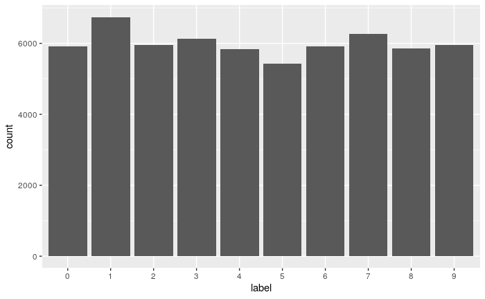
</center>
shown by the frequency graph above, about equal amount of images for each digit. 


2. Handwriting patterns and variations.

Let's take a look at first 25 images in the training data. It's clear that those digits are centered and manipulated with 
some anti-aliasing technique. As you might observe, among six 1's below, different styles appear such as italic version and  formal version. We can say that the data set has generalization of digit styles. 
<center>
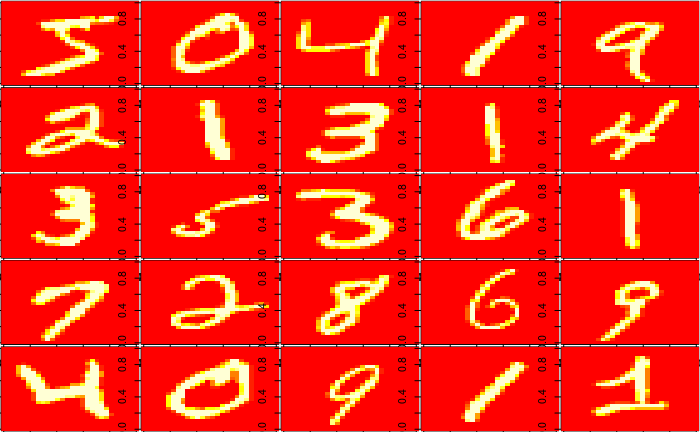
</center>
```{r, cache=TRUE, include=FALSE}
par(mfrow=c(5,5))
par(mar=c(0.1,0.1,0.1,0.1))
for (i in 1:25){
  image(matrix(train$x[i,],28)[,28:1])
}
```

Then for each digit, we average every pixels and get a mean form for each digit. 
<center>
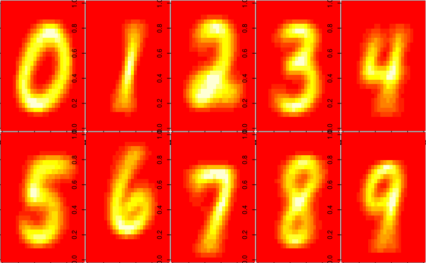
</center>

We calculate Euclidean distance for each image to its mean form and generate distance(to the mean) distributions for each digit. 
<center>

</center>
```{r data-preprocessing, cache= TRUE, include=FALSE}

# for each digit class, calculate the mean digit, mean distance from the mean digit and 
# variance of the distance

label <- seq(0,9) 

distance_mean <- rep(NA,10)
distance_var <- rep(NA,10)
mean_digits <- matrix(rep(0,7840),10)

par(mfrow=c(2,5))

for(i in 1:10){
  df <- train$x[train$y ==label[i],]   # create a dataframe with only the i-th digit
  mean_digit <- colMeans(df)            # get the mean form for each digit(0-9)
  mean_digits[i,] <- mean_digit         # store the mean image into mean_digits 
  dif <- sweep(df,2,mean_digit)         # store the difference for each image from its mean form 
  distance <- rowSums(dif^2)            # distance is an arrary of Euclidean distances from each image to its mean form
  distance_mean[i] <- mean(distance)
  distance_var[i] <- var(distance)
  
  # plot density of distances for each digit 
  plot(density(distance), xlab = "distance", ylab = "density", main = as.character(label[i]))
  axis(1, seq(0,80,20))
}

```


```{r, cache=TRUE, include=FALSE}
# Display the mean form for each digit
par(mfrow=c(2,5))
par(mar=c(0.1,0.1,0.1,0.1))
for (i in 1:10){
  image(matrix(mean_digits[i,],28)[,28:1]*255)
}
```

```{r, cache=TRUE}
dist_df <- data.frame(x = distance_mean, y = distance_var)
colnames(dist_df) <- c("mean", "var")
rownames(dist_df) <- label
print(dist_df)
```
From the summary table, we can see that digit 1 has the lowest mean distance; this indicates that most people write it similarly. 2 has the highest mean distance, so people tend to write 2 in different ways. We also see that 6 and 9 have the highest distance variance, which suggests these two digits have the most variation in people's writing styles. 


3. PCA & early predictions.

We use principal component analysis on the original data set and select first 20 PCs to capture 90% of the variance, see the scree plot below. 
<center>
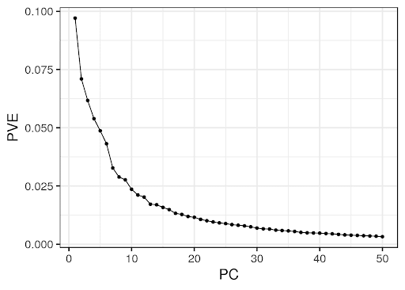
</center>

Let's visualize our digits with the first 2 PCs.
<center>
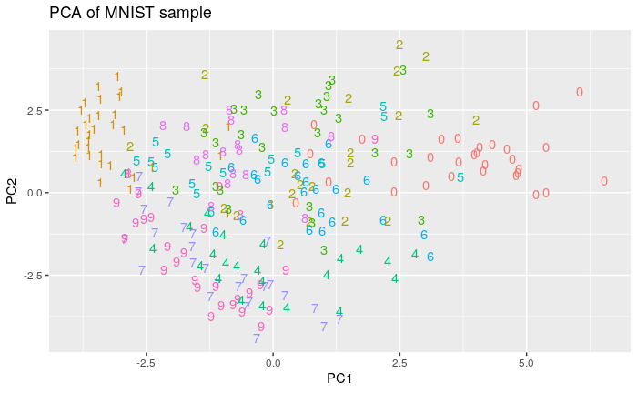
</center>
We can observe from the image that the 1-0 pair is well seperated while there is much overlapping between 4 and 9. Based on the distribution of digits, we think PC1 represents centerization of the digit, for example, 0 has more pixels on the outer area of 28 by 28 box. 1 has more pixels in the middle which can be illustrated from the mean images above. Thus, generally 0s has larger PC1 than 1s. We think PC2 is related to horizontal symmetry, for example, 3 and 1 are symmetric horizontally, which have larger PC2. 9 and 7 are not horizontally symmetric, which have lower PC2. 


Based on the PC graph above, we predict that the 1-0 pair will be easily recognized and 4-9 might be hard to seperate. 

## Modeling
**Construct (descriptive and/or predictive) (classification and/or regression) models that address your research questions. You are encouraged to fit many different classes of models and see how they compare in terms the bias/variance tradeoff (do you have a Rashomon effect going on?). Also be sure to guard against overfitting through cross-validation or shrinkage/penalization (don’t forget about ridge regression and the lasso).**

This will be the most extensive section and will include your results as well.


**A. Original dataset** 

Our first pruned classification tree had limited success. Even without pruning, the optimal number of nodes was selected (n = 16), and the graph of error against size showed no clear elbow indicating optimal size. 
  
<center>
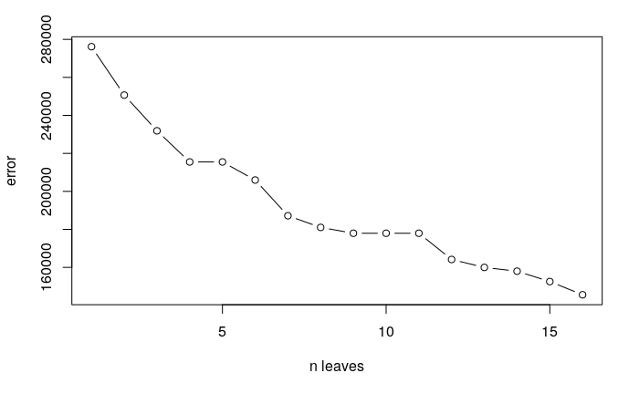
</center>
  
Looking at the tree plot, the important pixels (at each split) seem to be near the center of the image (around 400). The misclassification rate is near 40% (36.52%), as this is a rather weak model with a limited numer of splits.
  
<center>
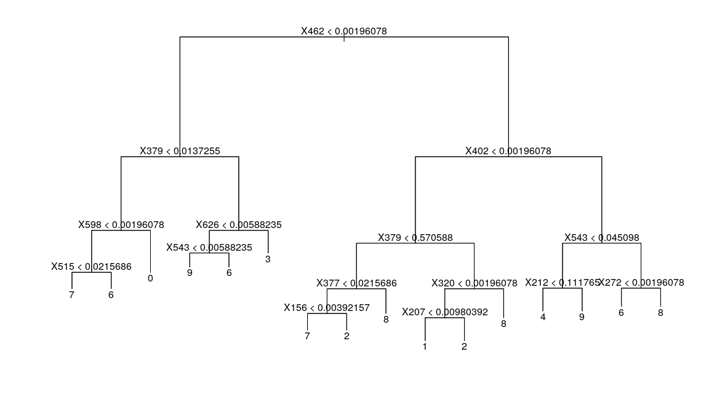
</center>

The first tree could not classify the class 5 with 16 splits (using the `tree` package), so we created a similar tree using another package (`rpart`) that successfully modeled all classes with only 14 splits. However, the misclassification rate for this model is slightly higher than the previous tree (38.04%), perhaps due to having fewer splits. 

<center>
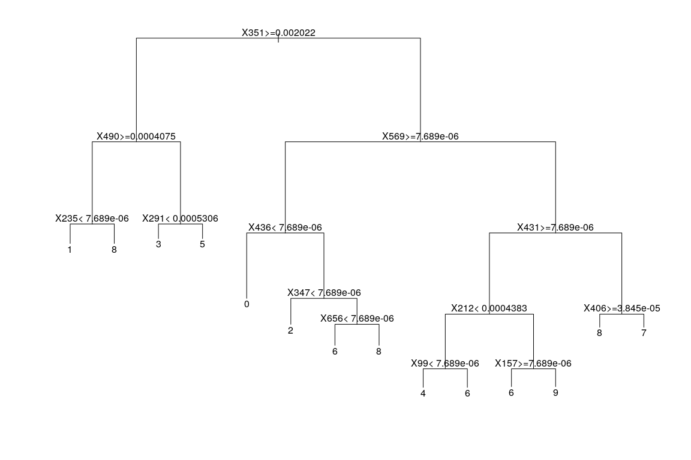
</center>

**B. PCA-reduced dataset**

We ran the classification tree model on the PCA-reduced dataset. Again, the best size was naturally chosen (n = 13) by the tree. 

<center>

</center>

From the tree plot, we can see that the two biggest splits happen at PC2 and PC1. These splits divided the PCA plot with two principle components into four regions. We observed that the digit 1 almost occupied the entirety of one region, which led to our hypothesis that this would be the easiest class to classify. We also noticed two groupings of digits, 8-5-3-0 in the upper region and 4-9-7-6 in the lower region. We expected the misclassification rate to be higher for these digits since they are closer to one another. 

<center>
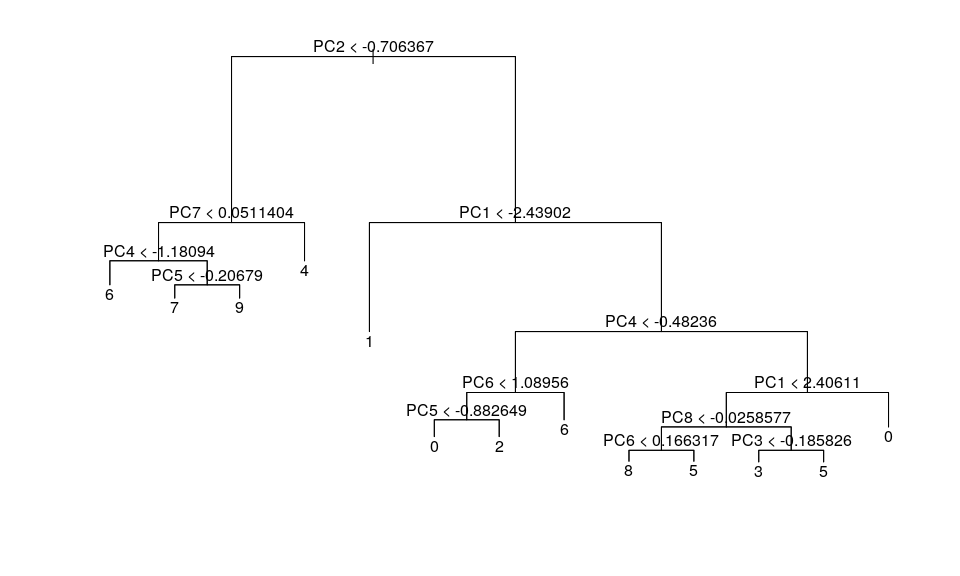
</center>

<center>
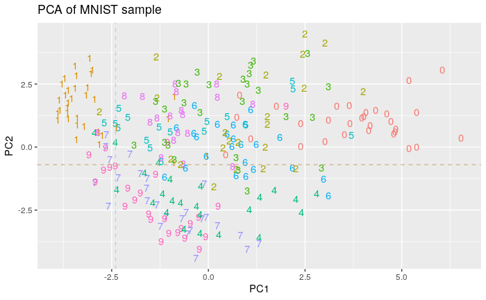
</center>

The misclassification rate for the tree model on the PCA-reduced dataset closely mirrors the result on the original dataset at 36.43%.

- **Random Forest**

**A. Original dataset**

We chose m=p/3 for the random forest.

The plot of error against the number of trees shows that the pixels had variable importance in predicting the random forest. This plot also shows that as long as there are 50-100 trees, error is rather low. 
  
<center>
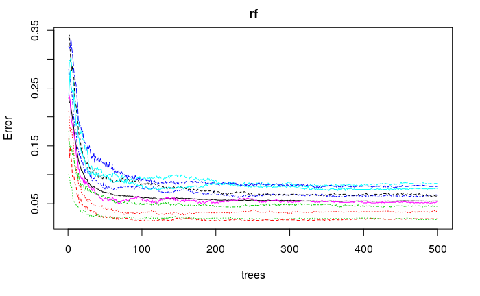
</center>
  
The mean decrease accuracy chart shows that the random forest identified 7-13 most important pixels, as did the simple tree. 

<center>

</center>
  
**B. PCA-reduced dataset**
  
On the PCA-reduced dataset, we also obseved that the error rate gradually flatlined when the best number of trees exceeds 50. The random forest considered all 20 PCs to be important predictors, as none of which was scored 0 in both the mean decrease accuracy and the mean decrease gini plots. The random forest identified 7-9 principle components as more important than others, among which PC1, PC2 and PC4 are considered the most important.

<center>
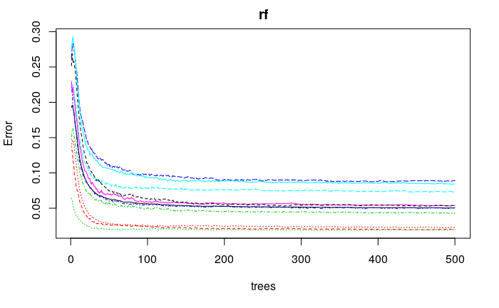
</center>

<center>
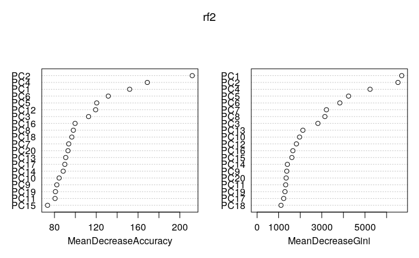
</center>
  
  
- **Bagged Trees**
  The bagged random forest (m = p) also identified a similar number of important pixels that seem to be near the center of the image. The error rate was the lowest when m=1 and the highest when m=p showing that there may be overfitting in the random forest, as it fairs better when less predictors are considered at each split.
  
- **Boosted Trees**

  The boosted model also identified a similar number of important pixels near the center of the image. The error rate for this model, 8%, is a little higher than the bagged random forest.
  
- **Multinomial Logistic Regression (with Ridge and Lasso)**

We present two ways to perform Multinomial Logistic Regression. 

**(a) Using one-vs-all classification**: 

We trained 10 different (binary) logistic regression classifiers, each recognizing one class of digits. For both the training and test dataset, we replaced the initial response variable (a nomial variable with 10 levels) with 10 dummy variables corresponding to the digits 0-9, each taking a value of (1) if the true label for the current digit was given, and (0) otherwise. We then assigned the new response variable to each of the classifier, and performed training using logistic regression with the `glm()` function.  

Using the trained logistic classifiers, we computed the probability that the current digit belongs to a class. We picked the class for which the corresponding logistic regression classifier outputs the highest probability as the predicted class for each input. We compared the returned prediction vector against the true labels to find the model accuracy. The misclassification rate using this method is 13.15%.

(reference code in appendix)

**(b) Using built-in package**:

We verified the above result using a built-in package called `nnet`, which supplies the `multinom()` function for multi-class logistic regression. The misclassification rate is 12.88%, which suggests that there is not much difference between the two methods.
 
To prevent overfitting, we applied Ridge and Lasso regularization. 

<center>
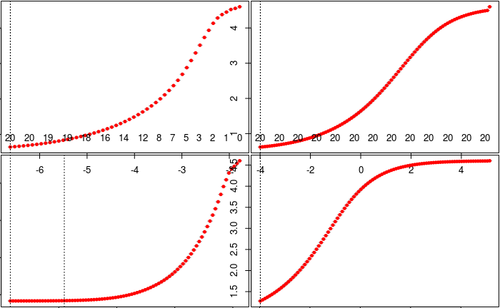
</center>

[Caption] x-axis is $\lambda$ values, y-axis is multinomial deviance. 

Clearly, as $\lambda$ increases, the model performs worse. The best model performance is observed at $\lambda$ = 0. 

Our lowest misclassification rate is 7.89% (using Ridge) on the original dataset and 11.95% (using Lasso) for PCA-reduced dataset, respectively. This further confirms that we did not encounter the problem of overfitting in our logistic model.

- **$k$ Nearest Neighbors**

We performed $k$-nearest neighbors (KNN) on both datasets. We used leave-one-out cross-validation (LOOCV) on the PCA-reduced data set to select the best $k$ value, which is 5. 

<center>
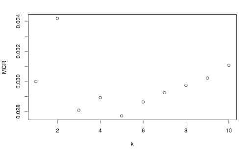
</center>

As it took too long to perform cross-validation on the original dataset, we also applied KNN with $k$ = 5 for this dataset. As a non-parametric model, KNN generates the second best result among all of our models. The misclassification rate is 3.06% on the original dataset and 3.02% on the PCA-reduced dataset respectively.

- **Support Vector Machine**

One of the most computationally intensive models we experimented with in this project is Support Vector Machine (SVM). 

In the simplest sense, SVM finds a hyperplane that best seperates two different classes. Using a kernel trick, SVM maps non-linear data points to a higher-dimensional space with arbitrary complexity. The model can then find a hyperplane that separates the samples in the transformed space. 

We can think of this as an automated way of creating polynomial terms or interaction terms in logistic regression. We chose the "radial" kernel (RBF) and achieved a **2.17%** misclassification rate, which is our best result so far. Below is the plot of the class regions for the SVM model using the first two PCs as the predictors. 

<center>
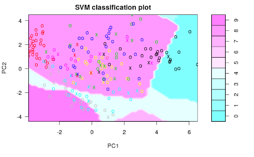
</center>

The built-in `plot()` method doesn't give us a clear visualization because we have 10 classes and 20 predictors, but it still shows us some decision boundaries with only 2 predictors, PC1 and PC2.

Unfortunately, we lacked the computing power to apply SVM on the original dataset, so we had to give up on this model eventually. However, we are positive that with the right choosing of kernel and tuned parameters, the SVM will generate a better result than 2.17% on the original dataset. 

## Discussion
**Review the results generated above and sythensize them in the context from which the data originated. What do the results tell your about your original research question? Are there any weaknesses that you see in your analysis? What additional questions would you explore next?**

- 4-9 is the most difficult pair to predict across models 
- No overfitting with PCA, but some with raw data 
- Best model
- Compare with published models


## References
**At minimum, this will contain the full citation for your data set. If you reference existing analyses, they should be cited here as well.**

Y. LeCun, L. Bottou, Y. Bengio, and P. Haffner. "Gradient-based learning applied to document recognition." Proceedings of the IEEE, 86(11):2278-2324, November 1998. [Online Version.](http://yann.lecun.com/exdb/mnist/)

